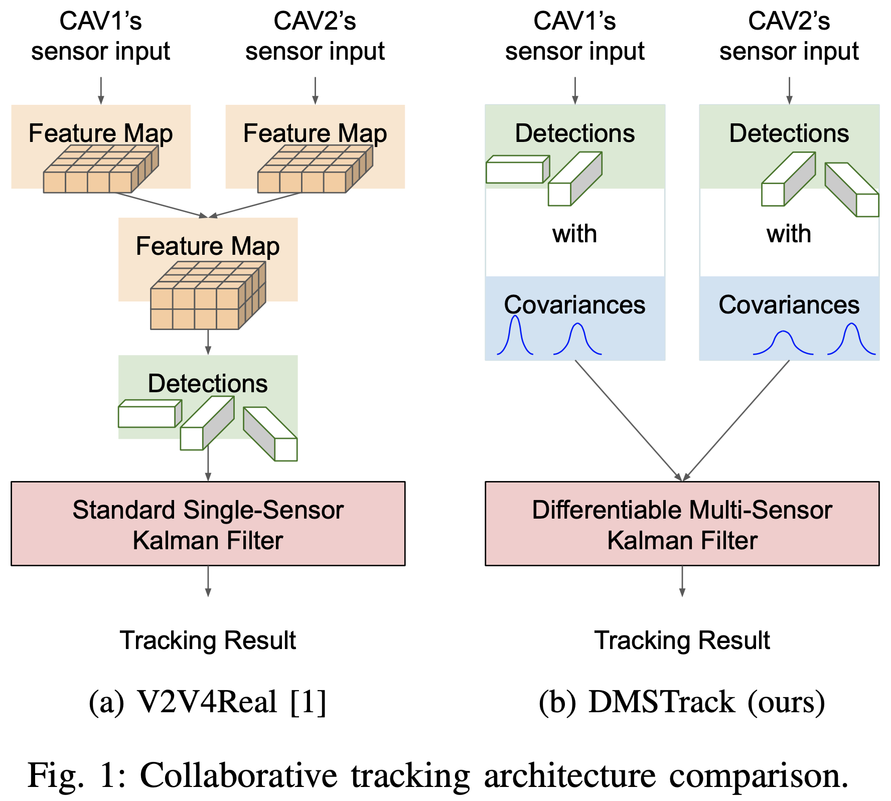

  
# Probabilistic 3D Multi-Object Cooperative Tracking for Autonomous Driving via Differentiable Multi-Sensor Kalman Filter

Hsu-kuang Chiu1, Chien-Yi Wang2, Min-Hung Chen2, Stephen F. Smith1

1Robotics Institute, Carnegie Mellon University, 2NVIDIA Research

[arxiv](https://arxiv.org/abs/2309.14655)

## Overview

We propose a novel algorithm: Differentiable Multi-Sensor Kalman Filter for 3D Multi-Object Cooperative Tracking (DMSTrack). Our algorithm is designed to be capable of estimating observation noise covariance of each detection from different Connected Autonomous Vehicles (CAVs) to better take advantage of the Kalman Filter’s theoretical optimality property: minimizing the expected error of state estimation. 

To train our Differentiable Multi-Sensor Kalman Filter neural model, we use each detection's local point cloud BEV feature and the positional feature as input. We calculate the regression loss by measureing the difference between the tracking result and the ground-truth. For more details, please refer to our paper at [arxiv](https://arxiv.org/abs/2309.14655).

The experiment results show that our algorithm improves the tracking accuracy by 17% with only 0.037x communication costs compared with the state-of-the-art method in V2V4Real\[1\].

  
## Experiment Result
The following table shows the cooperative tracking performance and communication cost in the testing split of V2V4Real \[1\] dataset in comparison with baseline methods. The baseline methods’ results contains the one from the V2V4Real \[1\] paper and our implementation.

| Method                             | AMOTA(↑) | AMOTP(↑) | sAMOTA(↑) | MOTA(↑)  | MT(↑)    | ML(↓)    | Cost (MB) (↓)
|------------------------------------|----------|----------|-----------|----------|----------|----------|---------------------------|
| CoBEVT \[1\]                       | 32.12    | 55.61    | 77.65     | 63.75    | 47.29    | 30.32    | 0.20
| CoBEVT (our implementation)        | 37.16    | 57.20    | 84.54     | 84.14    | 57.07    | 15.83    | 0.20
| DMSTrack (ours)                    | **43.52**    | **57.94**    | **91.50**     | **88.32**    | **68.35**    | **13.19**    | **0.0073**
