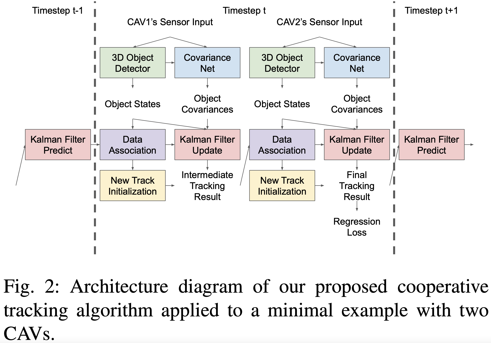

   
  
# Probabilistic 3D Multi-Object Cooperative Tracking for Autonomous Driving via Differentiable Multi-Sensor Kalman Filter

Hsu-kuang Chiu1, Chien-Yi Wang2, Min-Hung Chen2, Stephen F. Smith1

1Robotics Institute, Carnegie Mellon University, 2NVIDIA Research

 

